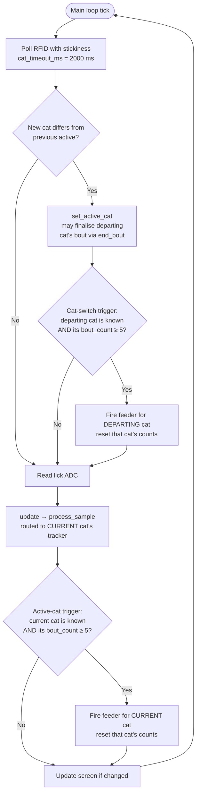
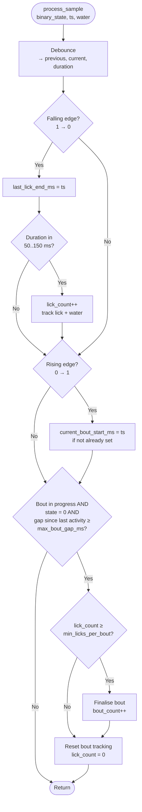
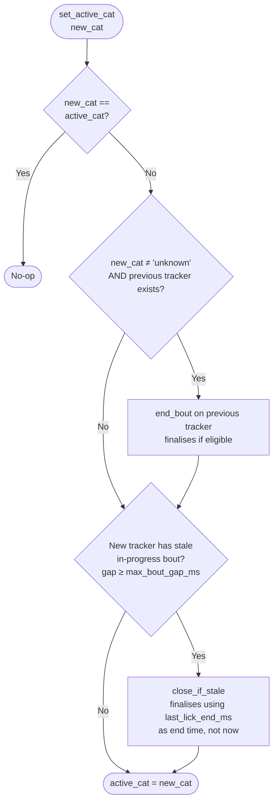

# HydraPurr

A CircuitPython-based device that monitors cat drinking behaviour at a shared water fountain and automatically dispenses food when a cat has completed enough drinking bouts. Each cat is identified by an RFID tag; bouts are detected from a contact sensor on the fountain; food is dispensed via a relay-controlled feeder.

## Project layout

```
HydraPurr/
├── BoardCode/            CircuitPython firmware that runs on the device.
│   └── lib/              Auto-loaded by CircuitPython (top of sys.path).
├── ProcessLickData/      Offline analysis of licks.dat / system.log.
├── BluetoothDownloader/  Prototype BT-based data downloader.
├── HardwareDocs/         WL-134 RFID reader docs (PDFs) + board netlist.
├── BoardPycharm/         PyCharm project config for working on BoardCode.
├── todo.md               Open / deferred / done items.
└── README.md             This file.
```

`BoardCode` and `ProcessLickData` are deliberately separate PyCharm projects to avoid refactoring tooling crossing between board firmware and offline code (different runtimes, different dependencies).

## Hardware

The device is built around an Adafruit RP2040 Feather running CircuitPython. Key peripherals (see `HardwareDocs/` for full schematic and reader Q&A):

- **WL-134 RFID reader** on UART (`board.D9` rx). Reads pet implant tags at 134.2 kHz. The reader has a "one shot per reset" model (no time-based dedup in firmware), so we pulse its RST pin at ~3 Hz and immediately after each successful read to keep it scanning. Polarity is inverted in hardware: the Pico drives `board.D11` HIGH through a transistor that pulls the reader's RST line to GND, so software writing `True` means "assert reset". This also resolves the 5 V vs 3.3 V mismatch noted in the Q&A doc.
- **Contact sensor** read via ADC channel 1 — a voltage signal where contact pulls the reading below `lick_threshold` (2.0 V).
- **Water-level sensor** read via ADC channel 0 — used to confirm real drinking via voltage swing during a bout.
- **Feeder relay** on `board.D6` via an NPN transistor — `feeder_on()` energises the relay for `deployment_duration_ms`.
- **OLED, BT module, NeoPixel, RTC, SD card** — wrapped behind component classes in `BoardCode/lib/components/`.

## Runtime flow — licks, bouts, deployment

How the device interprets contact-sensor samples and decides when to feed.

### Definitions

- **Lick**: a debounced contact event whose duration falls inside `[min_lick_ms, max_lick_ms]` (default 50–150 ms). Anything shorter or longer is discarded as noise.
- **Bout**: a run of valid licks where consecutive licks are separated by less than `max_bout_gap_ms` (default 5 min). A bout *counts* only if it contains at least `min_licks_per_bout` licks (default 3) and (optionally) the water-level swing during the bout exceeds `min_water_extent_per_bout` (default 0.013 V).
- **Deployment**: triggering the feeder relay for `deployment_duration_ms` (default 2 s). Fires when an *attributable* cat's `bout_count` reaches `deployment_bout_count` (default 5), then resets that cat's counts.

### Key parameters

| Parameter                       | Default          | Defined in           |
| ------------------------------- | ---------------- | -------------------- |
| `min_lick_ms` / `max_lick_ms`   | 50 / 150 ms      | `Settings.py`        |
| `min_licks_per_bout`            | 3                | `Settings.py`        |
| `max_bout_gap_ms`               | 300000 (5 min)   | `Settings.py`        |
| `min_water_extent_per_bout`     | 0.013 V          | `Settings.py`        |
| `cat_timeout_ms`                | 2000 ms          | `Settings.py`        |
| `deployment_bout_count`         | 5                | `Settings.py`        |
| `deployment_duration_ms`        | 2000 ms          | `Settings.py`        |
| `debounce_ms`                   | 5 ms             | `Settings.py`        |
| RFID refresh                    | 3 Hz (~333 ms)   | `Settings.py`        |
| `rfid_enabled`                  | `True`           | `Settings.py`        |
| `single_cat_name`               | `'henk'`         | `Settings.py`        |

### Single-cat mode

When `rfid_enabled = False`, the device skips RFID hardware init and pins the active cat to `single_cat_name` for the entire session. All licks attribute to that one cat, the cat-switch trigger never fires, and the active-cat trigger handles all deployments. Use this mode for single-cat households or while validating the rest of the pipeline before trusting the RFID layer. The cat-attribution diagrams below still describe the multi-cat path; in single-cat mode the `set_active_cat` call is made once at startup and never again.

### Logic walkthrough

#### How are licks detected?

The contact sensor is read via ADC: voltage below `lick_threshold` (2.0 V) means the cat is touching the sensor. Each main-loop iteration, `LickSensor.update` reads the ADC, converts to a binary state (1 = contact, 0 = no contact), and feeds it to the active cat's `BoutTracker.process_sample`.

The tracker debounces the input over `debounce_ms` (5 ms) so brief electrical noise can't fake a transition. On a clean falling edge (1 → 0) the tracker measures the contact duration:

- Below `min_lick_ms` (50 ms): too brief — discarded as noise.
- Above `max_lick_ms` (150 ms): too long — likely the cat resting on the sensor or a stuck signal, discarded.
- Between the two: counted as a valid lick. `lick_count` increments and the lick (with current water level) is appended to the current bout. A row is written to `licks.dat`.

#### How are bouts counted?

A bout is a sequence of valid licks where consecutive licks are separated by less than `max_bout_gap_ms` (5 min). The state machine in `BoutTracker`:

- The first rising edge (0 → 1) of a drinking session sets `current_bout_start_ms`. The tracker is now "in a bout".
- Each subsequent valid lick adds to the running list. `lick_count` is the running count within the current bout.
- A bout closes when state stays at 0 for ≥ `max_bout_gap_ms`. At close, the bout is *kept* (and `bout_count` increments) only if both:
  - `lick_count ≥ min_licks_per_bout` (default 3), and
  - water swing during the bout (`water_extent` = max − min) > `min_water_extent_per_bout` (default 0.013 V) — confirms real drinking caused water-level fluctuation, not just a paw resting on the sensor.

There are three paths that can finalise a bout (see *Bout-closure paths* below). All three honour the same eligibility check.

#### When does deployment happen?

Deployment fires the feeder relay (`HydraPurr.feeder_on()`) for `deployment_duration_ms` (2 s), then resets the cat's lick and bout counters. This is the food reward.

Each iteration evaluates two trigger conditions in order:

1. **Cat-switch trigger** — runs only on iterations where the active cat just changed. If the *departing* cat is known and their `bout_count ≥ deployment_bout_count` (default 5), deployment fires for them. This catches the case where `set_active_cat` just finalised their bout via `end_bout` and pushed them over threshold.
2. **Active-cat trigger** — runs every iteration. If the *current* cat is known and their `bout_count ≥ deployment_bout_count`, deployment fires for them. This catches the case where the gap-close inside `process_sample` (or `close_if_stale` inside `set_active_cat` when the cat returned) just pushed the current cat over threshold.

Both triggers require a *known* cat. The `unknown` tracker accumulates misattributed counts during RFID dropouts but is never feeder-eligible — feeding for `unknown` would be unfair across cats and would let licks during RFID outages indirectly trigger rewards.

Deployment is blocking — the main loop sleeps for `deployment_duration_ms` while food dispenses, so no licks or RFID reads happen during that window. Intentional.

### Per-iteration flow (MainLoop)



The cat-switch trigger evaluates only the *departing* cat (`switched_from`); the active-cat trigger evaluates only the *current* cat. Both gate against `unknown`. The two never fire for the same cat in the same iteration.

The RFID layer (`TagReader.poll_active`) returns the *last seen* cat within `cat_timeout_ms`. If no tag has been read for that long, it returns `None` and the cat resolves to `"unknown"`.

### Detection (BoutTracker.process_sample)

Each tracker is per-cat. Samples are routed only to the active cat's tracker; other trackers freeze until activated.



### Attribution (BoutManager.set_active_cat)

Runs every time the RFID-detected cat changes.



Three rules from this:

1. Switching **A → unknown** does **not** end A's bout. The dropout is treated as a transient RFID loss; A's state is preserved for resumption.
2. Switching **A → B** (both known) ends A's bout normally.
3. Switching **anything → known** runs `close_if_stale` on the new active cat's tracker — so a returning cat's pre-absence bout gets closed with a duration based on actual drinking, not on the absence.

### Bout-closure paths

| Path                | Triggered when                                              | End-time used         |
| ------------------- | ----------------------------------------------------------- | --------------------- |
| `process_sample`    | Active cat is silent for ≥ `max_bout_gap_ms`                | Current sample time   |
| `end_bout`          | `set_active_cat` from any cat to a *known* cat              | Switch time           |
| `close_if_stale`    | `set_active_cat` into a tracker with a stale ongoing bout   | `last_lick_end_ms`    |

Only the `process_sample` path emits a bout-closure marker row in `licks.dat`. The other two paths finalise silently — the offline analyzer reconstructs bouts from `lick == 1` resets, so this is fine.

## Data format

### `licks.dat`

CSV with columns (header auto-prepended by `MyStore`):

- `time` — wall-clock timestamp of the event.
- `mono_ms` — monotonic time in ms since boot at the event.
- `cat_name` — detected cat name from the RFID reader (may be `"unknown"`).
- `lick` — running count of valid licks within the current bout. Resets to 1 at the start of each new bout. On a bout-closure marker row, holds the total lick count of the just-closed bout.
- `bout` — cumulative bout count for the active cat at that moment.
- `water` — water level (V) sampled while in contact with the sensor.
- `duration_ms` — for a lick row, the contact duration; for a bout-closure marker, the silent gap that triggered the close. Lick rows have `min_lick_ms ≤ duration_ms ≤ max_lick_ms`; rows outside that window are bout-closure markers.

The device rotates `licks.dat` after `data_log_max_lines` lines, so a single recording may span multiple files in the same data folder.

### `system.log`

Comma-separated diagnostic log:

- `time` — wall-clock timestamp.
- `mono_ms` — monotonic time in ms since boot.
- `ticks` — system tick counter (integer).
- `level` — log level (`INFO`, `WARN`, `ERROR`, `DEBUG`).
- `source` — bracketed component label, e.g. `[Main Loop]`, `[RFID]`, `[HydraPurr]`.
- `message` — free-form text. Notable lines include cat-switch events, per-state summaries (`unknown: state=1 licks=0 bouts=0`), per-lick durations, "Last bout: …" summaries, and "Deployment bout count N reached, for X" events.

### Water-level vocabulary

- `delta` — `end_water − start_water`. Negative means voltage dropped, which means the sensor moved further from the water (water level fell, i.e. water was consumed).
- `extent` — `max(water) − min(water)` over the bout. Always positive — the total voltage swing, direction-agnostic. Used to filter out paw-touches: real drinking causes the water-level voltage to fluctuate.

## Development

- **`BoardCode`** runs on an Adafruit RP2040 Feather under CircuitPython and assumes the surrounding hardware (RFID reader, ADCs, OLED, relay, SD, BT module) is wired per the netlist in `HardwareDocs/`. You can't run it directly on a desktop without that hardware. The board contents can be kept in sync with this folder via the `DeviceSync` script (`/home/dieter/Dropbox/PythonRepos/DeviceSync`).
- **`ProcessLickData`** is desktop Python — use the `.venv` inside that folder. Entry point: `run_my_viz.py`.
- **CircuitPython `lib/` convention.** CircuitPython auto-adds `/` and `/lib` to `sys.path` on boot, so any `.py` file or package directory directly under `lib/` is importable as a top-level module (`import adafruit_pcf8523`, `from components import MyADC`). Do **not** add `lib/__init__.py` — that turns `lib` into a package and breaks the standard CircuitPython import style. To get the same behaviour in PyCharm during desktop development, mark `lib/` as a Sources Root (Right-click → *Mark Directory as → Sources Root*).
- The lick-processing logic is kept in sync between board and offline code: real-time detection lives in `BoardCode/lib/BoutDetection.py`; offline analysis of the resulting `licks.dat` lives in `ProcessLickData/analysis/BoutAnalyzer.py`. Both honour the same `Settings.py` parameters.

## Project notes

- Notion workspace for organisation: <https://www.notion.so/PyCharm-25581ad79c6d8070aaf2cc3cb64adce6>
- The older Raspberry Pi version of HydraPurr is archived (read-only reference): <https://github.com/habit-tech/Rpi_lickometer>. Local copy lives in this repo for archival purposes; the Pi codebase is unlikely to be developed further.
- Open / deferred items live in [`todo.md`](todo.md).

## Viewing the diagrams

This README uses [Mermaid](https://mermaid.js.org/) for the flowcharts above. They render automatically on:

- GitHub (when viewing the file in the web UI).
- VS Code (built-in markdown preview).
- PyCharm / IntelliJ (with the Mermaid plugin).
- [mermaid.live](https://mermaid.live) (paste a single fenced block — without the ```mermaid wrapper).

If you see raw `flowchart TD ...` text, your viewer doesn't render Mermaid — try one of the above.
