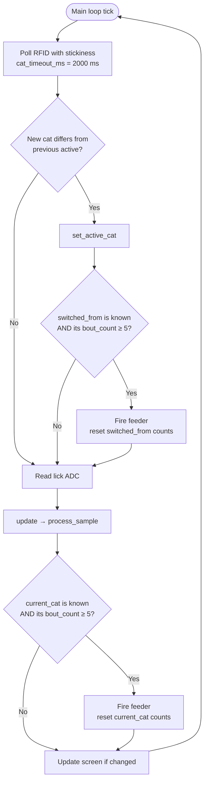
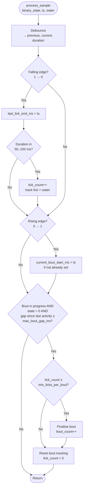
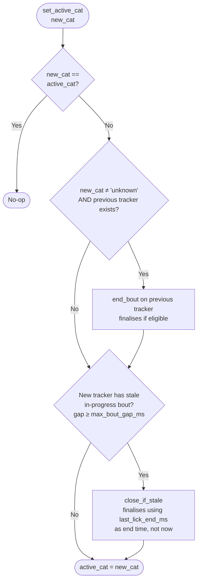

# Runtime flow — licks, bouts, deployment

How the device interprets contact-sensor samples and decides when to feed, after the recent cleanup pass.

## Definitions

- **Lick**: a debounced contact event whose duration falls inside `[min_lick_ms, max_lick_ms]` (default 50-150 ms). Anything shorter or longer is discarded as noise.
- **Bout**: a run of valid licks where consecutive licks are separated by less than `max_bout_gap_ms` (default 5 min). A bout *counts* only if it contains at least `min_licks_per_bout` licks (default 3) and (optionally) the water-level swing during the bout exceeds `min_water_extent_per_bout` (default 0.013 V).
- **Deployment**: triggering the feeder relay for `deployment_duration_ms` (default 2 s). Fires when an *attributable* cat's `bout_count` reaches `deployment_bout_count` (default 5), then resets that cat's counts.

## Key parameters

| Parameter                       | Default          | Defined in           |
| ------------------------------- | ---------------- | -------------------- |
| `min_lick_ms` / `max_lick_ms`   | 50 / 150 ms      | `Settings.py`        |
| `min_licks_per_bout`            | 3                | `Settings.py`        |
| `max_bout_gap_ms`               | 300000 (5 min)   | `Settings.py`        |
| `min_water_extent_per_bout`     | 0.013 V          | `Settings.py`        |
| `cat_timeout_ms`                | 2000 ms          | `Settings.py`        |
| `deployment_bout_count`         | 5                | `Settings.py`        |
| `deployment_duration_ms`        | 2000 ms          | `Settings.py`        |
| `debounce_ms`                   | 5 ms             | `BoutDetection.py`   |
| RFID refresh                    | 3 Hz (~333 ms)   | `Settings.py`        |

## Per-iteration flow (MainLoop)

The main loop runs continuously, polling RFID and the lick sensor on every tick.

The RFID layer (`TagReader.poll_active`) returns the *last seen* cat within `cat_timeout_ms`. If no tag has been read for that long, it returns `None` and the cat resolves to `"unknown"`.

## Detection (BoutTracker.process_sample)

Each tracker is per-cat. Samples are routed only to the active cat's tracker; other trackers freeze until activated.

## Attribution (BoutManager.set_active_cat)

The function that runs every time the RFID-detected cat changes.

Three rules from this:
1. Switching **A → unknown** does **not** end A's bout. The dropout is treated as a transient RFID loss; A's state is preserved for resumption.
2. Switching **A → B** (both known) ends A's bout normally.
3. Switching **anything → known** runs `close_if_stale` on the new active cat's tracker — so a returning cat's pre-absence bout gets closed with a duration based on actual drinking, not on the absence.

## Bout-closure paths

A bout can be finalised in three places:

| Path                | Triggered when                                              | End-time used         |
| ------------------- | ----------------------------------------------------------- | --------------------- |
| `process_sample`    | Active cat is silent for ≥ `max_bout_gap_ms`               | Current sample time   |
| `end_bout`          | `set_active_cat` from any cat to a *known* cat             | Switch time           |
| `close_if_stale`    | `set_active_cat` into a tracker with a stale ongoing bout  | `last_lick_end_ms`    |

Only the `process_sample` path emits a bout-closure marker row in `licks.dat` (a row with `duration_ms` outside the valid lick window). The other two paths finalise silently — the offline analyzer reconstructs bouts from `lick == 1` resets, so this is fine.

## Deployment

Two triggers, both gated against `unknown`:

- **Cat-switch trigger** (`MainLoop.py:93-109`): on cat change, if the *departing* cat had at least `deployment_bout_count` finalised bouts. Skipped when `switched_from == 'unknown'`.
- **Active-cat trigger** (`MainLoop.py:143-151`): each iteration, if the *current* cat's `bout_count ≥ deployment_bout_count`. Skipped when `current_cat == 'unknown'`.

Both: `feeder_on()` → blocking `sleep(deployment_duration_ms)` → `feeder_off()` → `reset_counts(cat)`. The blocking sleep is intentional (detection pauses while food dispenses).

`unknown` accumulates misattributed counts but is never feeder-eligible.

## Logging

Each row in `licks.dat` is one of:

- **Valid lick row**: `duration_ms ∈ [min_lick_ms, max_lick_ms]`, `lick` is the running count within the current bout (1, 2, 3, ...). Bout boundaries are detected offline by `lick == 1` resets.
- **Bout-closure marker** (gap-close path only): `duration_ms` is the silent gap that triggered the close (out of the valid lick window), `lick` is the total lick count of the just-closed bout.

`BoutAnalyzer.analyze_dataframe` drops bout-closure markers via the duration filter and groups the remaining rows on `lick == 1`.

## Viewing the diagrams

This document uses [Mermaid](https://mermaid.js.org/) for flowcharts, embedded as fenced code blocks. They render automatically on:

- GitHub (when viewing the file in the web UI)
- VS Code (with the markdown preview)
- PyCharm / IntelliJ (with the Mermaid plugin)
- mermaid.live (paste any single block to view)

If you see raw `flowchart TD ...` text, your viewer doesn't render Mermaid — try one of the above.
